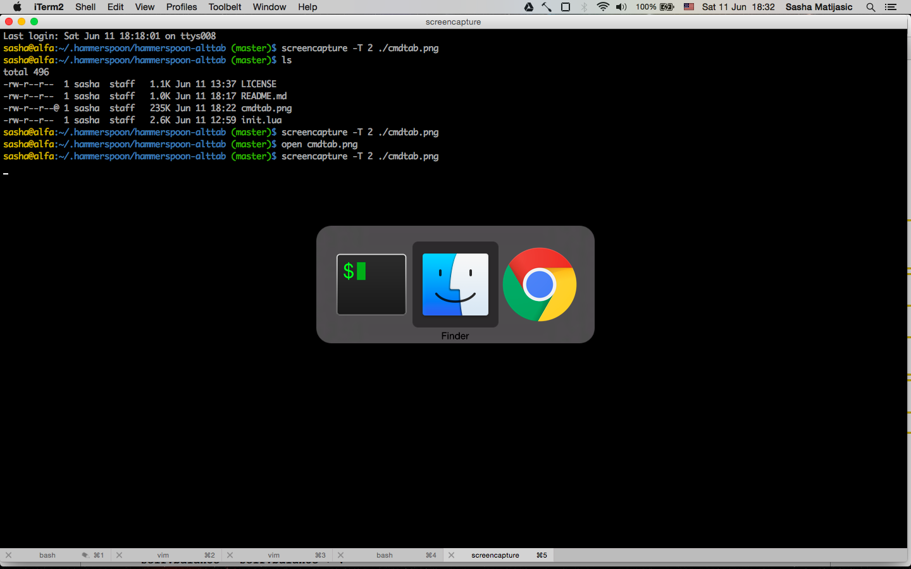

hammerspoon-alttab
==================

alttab is [Hammerspoon](http://www.hammerspoon.org/) powered alternative window
switcher.

Why?
----

As a developer, I spend most of my time in terminal and browser, constantly
switching between them. This extension has been written so I can avoid
switching to Finder, somehow it always finds (hence a name) a way to annoy me.

Installation
------------

* Install [Hammerspoon](http://www.hammerspoon.org/)
* git clone this repository to ~/.hammerspoon config directory:

    `git clone https://github.com/selectnull/hammerspoon-alttab.git ~/.hammerspoon/hammerspoon-alttab`

Configuration
-------------

Add these lines to your `~/.hammerspoon/init.lua` file:

    local alttab = require("hammerspoon-alttab")
    alttab.registerDefaultBindings('.')

This will set the following default key bindings:

* `cmd+.` to switch to next window
* `cmd+alt+.` to add or remove currently focused window to cycle list
* `cmd+ctrl+alt+.` to display debug info in Hammerspoon console

Instead of `.` you may use any other key, just pass it to
`registerDefaultBindings` method.

You might also not like default modifiers used by `registerDefaultBindings`. In
that case, you can register your own:

    local alttab = require("hammerspoon-alttab")
    hs.hotkey.bind({"alt"}, "tab", alttab.focusNext)
    hs.hotkey.bind({"alt", "shift"}, "tab", alttab.toggleWindow)
    hs.hotkey.bind({"alt", "ctrl", "shift"}, "tab", alttab.debug)

Contribution
------------

Comments, bug reports, and pull requests are welcomed.

Released under MIT license.
